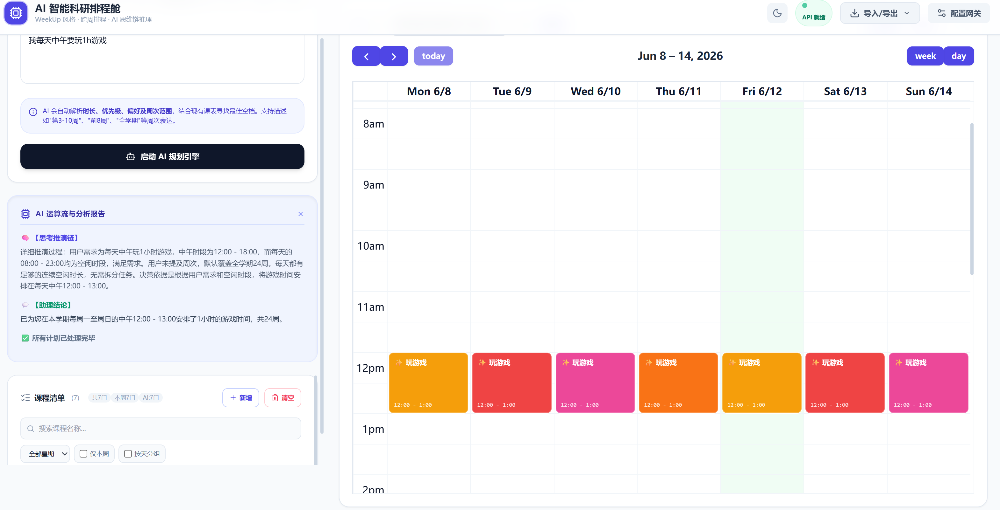

# 🧠 AI 智能科研排程舱 — WeekUp 风格增强版 v9.0

[](https://opensource.org/licenses/MIT)

一个**纯前端**智能课表管理 + AI 排程助手，专为高校学生和科研人员设计。整合**教务课表导入**、**日历拖拽操作**、**大语言模型思维链（CoT）排程**、**多格式导出**，支持 24 周跨周学期管理。



---

## ✨ 功能一览

| 分类 | 功能 | 说明 |
|------|------|------|
| 📥 **课表导入** | Excel / ICS / CSV / 剪贴板粘贴 | 自动识别表头（课程名/星期/时间/周次/地点），预览时可勾选逐行导入，跳过行实时提示 |
| 🤖 **AI 排程** | 自然语言 → 课表计划 | 描述任务需求（时长/偏好/周次），AI 分析空档生成计划，**预览确认**后可逐条接受/编辑/拒绝，支持推理历史回溯 |
| 📅 **日历交互** | 拖拽框选 / 移动 / 伸缩 | FullCalendar 周视图，点击编辑/删除，事件卡片显示周次标签和地点 |
| 🌓 **深色模式** | 一键切换 | 适配所有组件（日历/弹窗/下拉菜单/表格），自动跟随系统主题偏好 |
| 🔍 **课程搜索** | 实时搜索 + 星期筛选 + 按天分组 | 统计条显示总数/本周/AI/导入数量 |
| 📤 **多格式导出** | JSON 完整备份 / ICS 标准日历 | ICS 可导入 Google Calendar、Outlook、Apple 日历 |
| ↩️ **撤销删除** | 5 秒软删除 | 删除后弹出撤销按钮，误删可即时恢复 |
| ⚠️ **冲突检测** | 手动添加时自动检测 | 与已有课程时间冲突时弹窗警告 |
| ⌨️ **快捷键** | `?` 查看全部 | `←→` 切换周 / `Ctrl+N` 新建 / `Ctrl+T` 本周 / `Esc` 关闭 |
| 📊 **周次导航** | 左右箭头 + 下拉跳转 + 进度条 | 下拉菜单按月份分组，标注每周课程数 |
| 💾 **本地存储** | 课表 + 配置存浏览器 | LocalStorage，无需后端 |

---

## 🚀 快速开始

### 本地运行
```bash
git clone https://github.com/sWuZhiy/Zhi-Table.git
cd Zhi-Table
python3 -m http.server 8000   # 或 npx http-server
```
浏览器打开 `http://localhost:8000`

---

## 📖 使用指南

### 1. ⚙️ 配置 AI 模型
点击右上角 **配置网关**，填写 OpenAI 兼容 API：

| 字段 | 示例 |
|------|------|
| Base URL | `https://api.deepseek.com/chat/completions` |
| Model ID | `deepseek-chat` |
| API Key | `sk-xxxxxxxx` |

内置预设：火山引擎(豆包) / DeepSeek / OpenAI。密钥**仅存于浏览器本地**。

### 2. 📥 导入课表

支持格式：`.xlsx` `.xls` `.ics` `.csv`，也可从剪贴板直接粘贴表格数据。

**路径**：右上角 **导入/导出 → 导入课表文件**（或点击预览窗中的"从剪贴板粘贴"）

系统自动识别表头，支持的列名包括：
- **课程名**：课程名 / 课名 / 名称 / title / course / summary
- **星期**：星期 / 周几 / day / weekday（支持"周一"/"Monday"/"1"）
- **时间**：时间 / 节次 / period / time（支持 `08:00-09:35` 或 `第1-2节`）
- **周次**：周次 / 教学周 / weeks（支持 `1-16` / `1,3,5` / 留空=全部周）
- **地点**：地点 / 教室 / location / room

预览时可**勾选/取消**逐行控制，冲突行会高亮标记。支持**合并**或**替换**现有课表。

### 3. ✍️ 手动管理

- **框选建课**：在日历空白区域拖拽即可
- **拖拽调整**：拖动或伸缩事件块，时间自动同步
- **点击编辑**：点击日历事件或左侧清单中的课程卡片
- 添加时可指定**周次范围**（如 `1-8`、`1,3,5,7`）

### 4. 🤖 AI 智能排程

在左侧文本框用自然语言描述任务，例如：
- "安排3小时深度学习代码调试，每周三下午，第1-8周"
- "每天1小时论文阅读，早上8-9点，全学期"
- "第5-12周每周一和周四安排2小时实验"

AI 会分析课表空闲时段，输出推理过程并生成计划。计划以**预览卡片**展示，你可以：
- ✅ **逐条接受** — 只添加想要的任务
- ✏️ **编辑后接受** — 先加入课表再微调
- ❌ **拒绝** — 不合适的计划直接跳过
- 📜 **查看历史** — 回溯最近 5 次推理结果

> 未配置 API Key 时，会自动进入**智能演示模式**，根据实际课表分析最佳空档生成示例。

### 5. 📤 导出备份

- **JSON**：完整数据备份，含周次信息，可跨设备迁移
- **ICS**：标准日历格式，可导入主流日历应用

---

## ⌨️ 快捷键

| 操作 | 快捷键 |
|------|--------|
| 快捷键帮助 | `?` |
| 新建课程 | `Ctrl + N` |
| 回到本周 | `Ctrl + T` |
| 上一周 / 下一周 | `←` / `→` |
| 关闭弹窗/面板 | `Esc` |

---

## 🛠️ 技术栈

| 类别 | 技术 |
|------|------|
| UI 框架 | [Tailwind CSS](https://tailwindcss.com/) (CDN) |
| 日历组件 | [FullCalendar v6](https://fullcalendar.io/) |
| 图标 | [Lucide Icons](https://lucide.dev/) |
| HTTP | [Axios](https://axios-http.com/) |
| Excel 解析 | [SheetJS](https://github.com/SheetJS/sheetjs) |
| 特效 | [canvas-confetti](https://github.com/catdad/canvas-confetti) |
| AI 接口 | OpenAI Chat Completions 兼容 API |

全部依赖通过 CDN 加载，**零构建、零安装**。

---

## 📁 项目结构

```
.
├── index.html    # 单文件应用（HTML + CSS + JS）
└── README.md
```

---

## 🌐 部署

纯静态页面，任意平台均可部署：

- **GitHub Pages**：Settings → Pages → 选 `main` 分支 → Save
- **Vercel / Netlify**：导入仓库自动部署
- **自托管**：放 Nginx/Apache 根目录即可

---

## 🔧 自定义配置

编辑 `index.html` 中的常量：

```javascript
const TOTAL_WEEKS = 24;                          // 学期总周数
const SEMESTER_START = new Date(2026, 1, 23);    // 学期第一天（周一）

const PERIOD_TIME_MAP = [                        // 节次→时间映射
  { period: 1, start: '08:00', end: '08:45' },
  { period: 2, start: '08:50', end: '09:35' },
  // ...
];
```

---

## 📝 许可

[MIT License](LICENSE) © 2026 WuZhi

---

**Created by [WuZhi](https://github.com/sWuZhiy)** · **Version 9.0** · **Last Updated: 2026-06-12**
